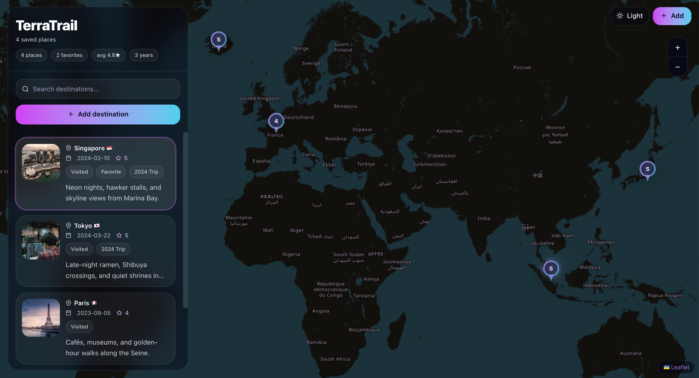

# TerraTrail 🌍

TerraTrail is a modern interactive travel journal where users can pin destinations, attach memories, and explore trips on a beautifully designed world map.

Built to explore modern map-based UI design, smooth interactions, and travel-focused user experiences using React and Leaflet.

## Live Demo

[Live Demo](https://terratrail-geojournal.vercel.app/)

## Preview



**Tech stack**
- React + Vite
- Tailwind CSS (utility-first styling)
- React Leaflet + OpenStreetMap tiles
- LocalStorage persistence (no backend)
- React Icons


## Features

- 🌍 Interactive world map with custom destination markers
- 📍 Smart location pinning via map click or typed destination search
- 📝 Travel journal entries with notes, ratings, and images
- 🔎 Searchable sidebar with animated destination cards
- ✨ Smooth fly-to map animations and interactive popups
- 💾 Persistent storage using LocalStorage
- 📱 Responsive modern UI built with Tailwind CSS

## Getting started

**Install**
```bash
npm install
```

**Run locally**
```bash
npm run dev
```

**Production build**
```bash
npm run build
npm run preview
```

## Project structure
```txt
src/
  components/
    AddPlaceModal.jsx
    MapView.jsx
    Sidebar.jsx
    PlaceCard.jsx
  data/
    storage.js
  App.jsx
  main.jsx
  index.css
```

## Leaflet notes
- Leaflet CSS is imported in `src/main.jsx`.
- Default marker icon URLs are fixed in `src/main.jsx` (common issue with bundlers).
- Map tiles: `https://{s}.tile.openstreetmap.org/{z}/{x}/{y}.png`

## Future Improvements

- Destination autocomplete suggestions
- Authentication and cloud sync
- Image uploads
- Marker clustering
- Trip statistics dashboard
- Route visualization between destinations